# Aide memoire en MDX
Dans ce t'article je vais essayer comprendre les bases du langage **MDX**

## Mythes et réalités sur le MDX

## Agenda

## MDX vs SQL

## Problematique résolue par MDX
### Problematique 1 

#### Solution en MDX

* il faut tout d"abord noter que les sont préceder par le mot clé **[Measure]** donc après on voit la mesure **[Reseller Sales Amount]**
* **ON 0** qui est équivalent de **ON ROW** c'est à dire l'affichage en ligne 
##### Requets 2

##### Résultat de la requet 2

*  **ON 1** correspond à **ON COLUMN** c'est à dire l'afichage en colonne
*  **NON EMPTY** pour dire de ne récupérer que les cellules non vides
##### Cross Join
le cross join est introduit en MDX par l'operateur *

##### Résultat de Cross Join

##### Trois axe ou encore l'axe de filtre

##### Resultat du filtre
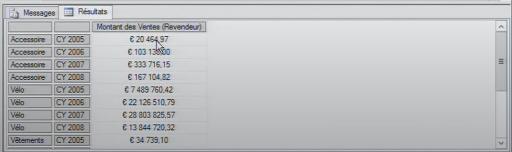
##### Résumé

### Problematique 2

#### Solution en MDX
##### Sous cube requete(sous request)

c'est une sous requete ou sous cube qui comprend les France et Royaume Unit et l'intersection avec la categorie velo
##### Résultat sous cube

### Autres Requetes
#### Pourcentage
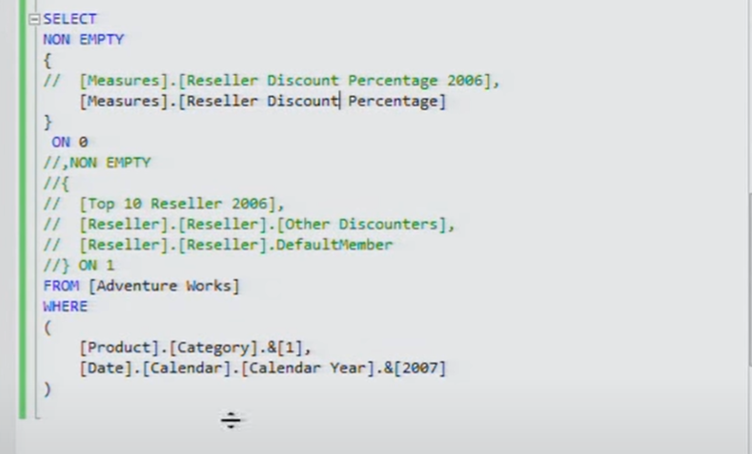
#### Resultat en en paourcentage
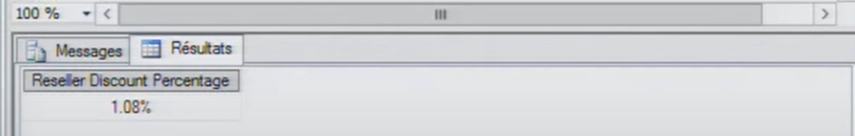

### Les requetes géometriques
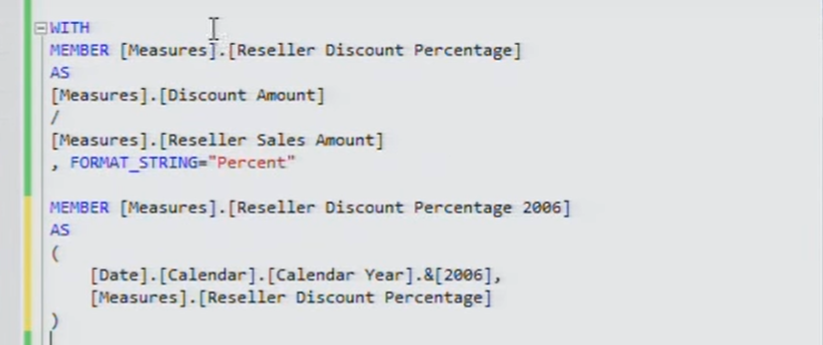
### Resultat Requete mesure géometrique

#### Top 10 des clients
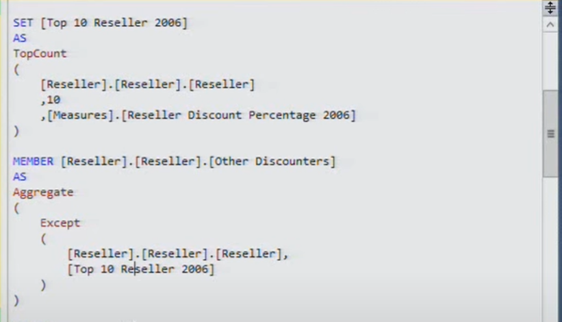
#### Resultat top 10
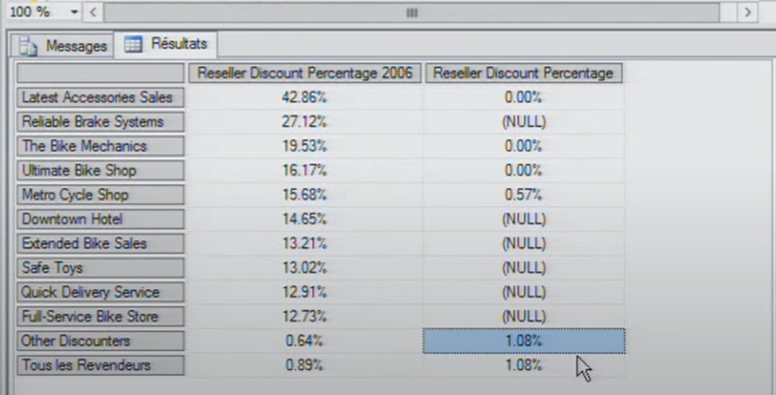
#### Sous Ctégories des parents 

##### Requetes
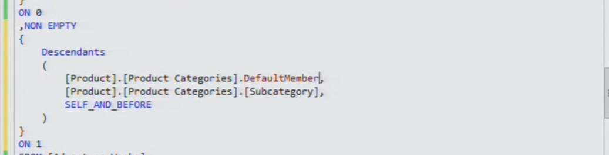
##### Resultat 
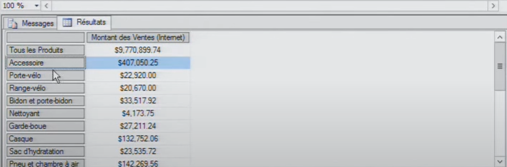
#### La contribution d'une requete par rapport à son parent
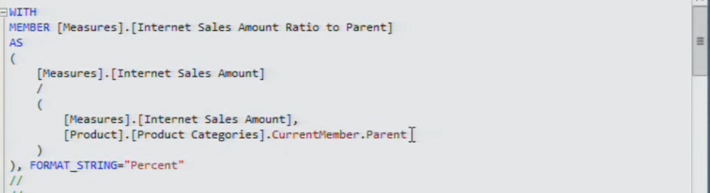
#### Resultat
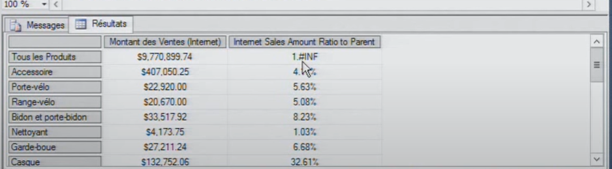

## Niveau Expert

### Exemple Niveau expert

### Affiché tous le montant sur toute l'année

### Résultat
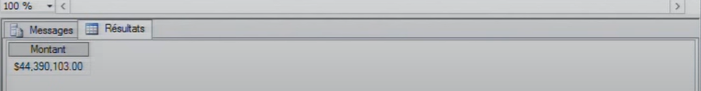

### Afficher les montants des années fiscales sur les mois fiscaux
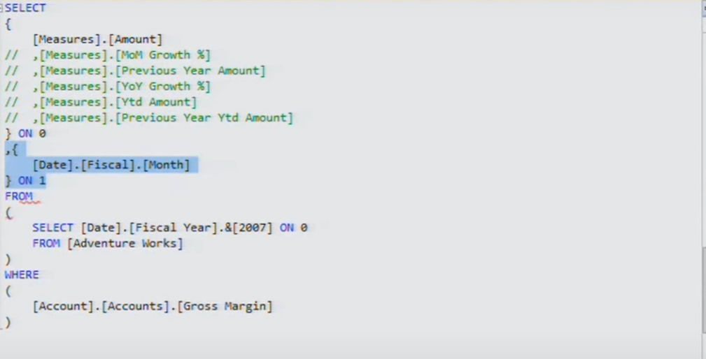
### Résultat
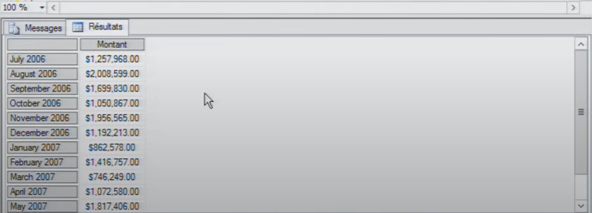
## Résumé

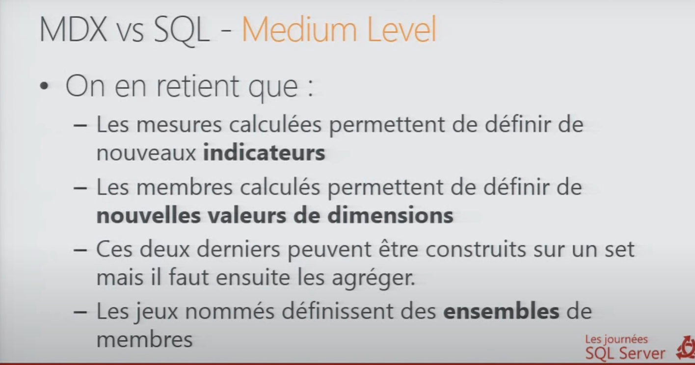
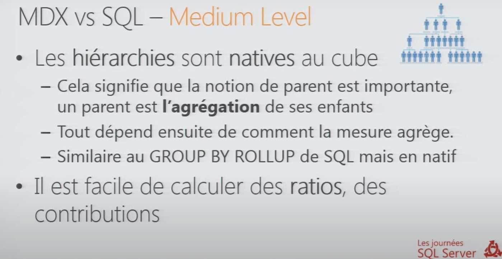

## Ressources
1. [Lien util](https://fjehl.wordpress.com/2012/04/16/le-mdx-cest-facile-enfin-presque/)
2. [les journées SQL Server](https://www.youtube.com/watch?v=C47Ysr4Tv8o&t=330s)